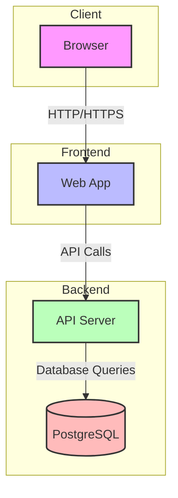
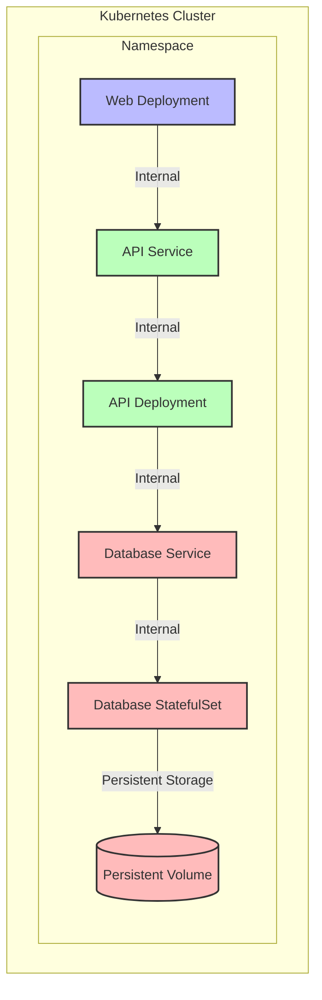

# Architecture Documentation

## System Overview

This document describes the architecture of our monorepo starter application, which consists of a web frontend, API backend, and PostgreSQL database.

## Component Diagram

## Deployment Architecture

## Component Details

### Frontend (Web)

- React-based web application
- Served on port 3000
- Communicates with API via HTTP/HTTPS

### Backend (API)

- Express.js server
- Served on port 3001
- Handles business logic and data processing
- Communicates with database using Prisma ORM

### Database (PostgreSQL)

- PostgreSQL 16 (Alpine)
- Persistent storage for data
- Accessible on port 5432
- Used for storing application data

## Deployment Configurations

### Docker Compose (Development)

- All services run in containers
- Services communicate via Docker network
- Database data persists through Docker volumes
- Environment variables for configuration

### Kubernetes (Production)

- Services deployed as Kubernetes resources
- Database runs as StatefulSet with persistent storage
- Internal service communication via Kubernetes services
- Resource limits and requests defined for each component

## Environment Variables

### API Service

- `DATABASE_URL`: Connection string for PostgreSQL

### Database Service

- `POSTGRES_USER`: Database user
- `POSTGRES_PASSWORD`: Database password
- `POSTGRES_DB`: Default database name

## Network Configuration

### Docker Compose

- External network `app_network` for service communication
- Port mappings for external access
- Internal DNS resolution via service names

### Kubernetes

- Internal service communication via service names
- ClusterIP services for internal routing
- Persistent volume claims for database storage
